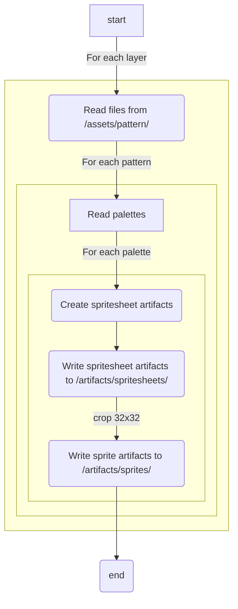
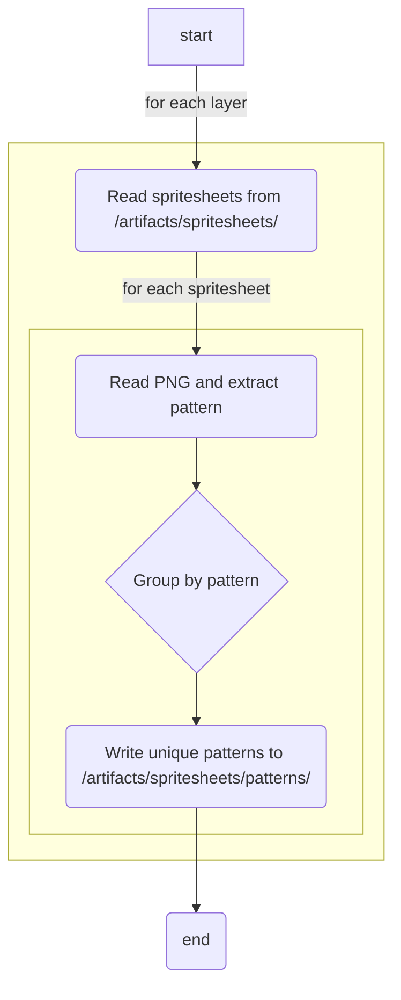

# openavatar-assets

The `openavatar-assets` project contains all of the assets and scripts for generating and exporting the avatar assets for the OpenAvatar protocol.

## Usage

To build the assets for the OpenAvatar app, you will need to run the following commands:

```bash
yarn build
```

Once complete, the assets can be found in the `artifacts` directory and will be ready for use.

## Directory Structure

- `artifacts`: Generated assets
- `assets`: Source assets
- `assets/palettes`: Source palettes for each layer
- `assets/pattern`: Source assets for each layer
- `assets/photoshop`: Photoshop files used to generate the spritesheets (out of date)
- `scripts`: Scripts for building and transforming assets
- `src`: Source code for the build process
- `test`: Tests for the build process

## Render Pipeline



## Patternize (inverse) Pipeline



## Layers

The avatar is composed of the following layers stacked on top of each other:

- body
- tattoos
- makeup
- facial hair
- left eye
- right eye
- footwear
- bottomwear
- topwear
- outerwear
- handwear
- jewelry
- facewear
- eyewear
- hair

## License

License pending. Stay tuned for more information.

## Attribution

Art assets and scripts were created by Cory Gabrielsen (cory.eth). Every pixel was drawn by hand.

The following creative tools were used extensively:

- Adobe Photoshop
- Aseprite
