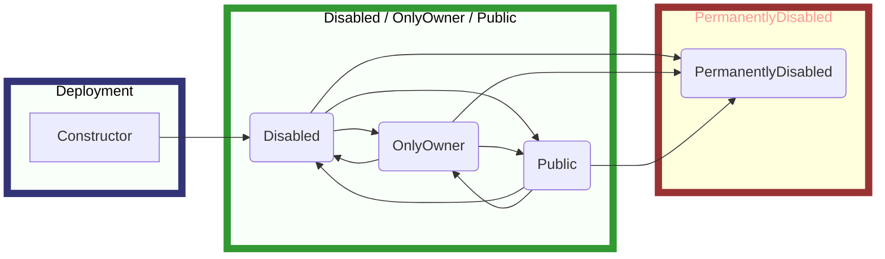

# openavatar-contracts

The `openavatar-contracts` project contains all of the Ethereum smart contracts for managing the avatars and scripts for deploying and interacting on chain. It
also includes libraries for image encoding.

## Usage

1. To build the contracts for the OpenAvatar app, you will need to run the following commands:

```bash
yarn build
```

2. Start a local blockchain:

```bash
yarn start:ethereum
```

3. Deploy the contracts and upload the assets to the local blockchain:

```bash
yarn launch
```

## Dependencies

Contract dependencies are as follows:

- [OpenZeppelin Contracts](https://github.com/OpenZeppelin/openzeppelin-contracts): A library for secure smart contract development.

- [ERC721A](https://github.com/chiru-labs/ERC721A): an improved implementation of the IERC721 standard that supports minting multiple tokens for close to the cost of one.

## Mint State Machine



## Directory Structure

The repository structure for the OpenAvatar app consists of the following files and directories:

- `contracts`: Ethereum smart contracts written in Solidity.
- `scripts`: Scripts for deploying and interacting with the contracts, as well as debug scripts for PNG encoding.
- `src`: Source code to support the build, deploy, upload, mint, and render scripts/tasks.
- `tasks`: Hardhat tasks for deploying, uploading, minting, and rendering avatars.
- `test`: Tests for the contracts and other source code.

## Security

The smart contracts in this repository have not been audited. Use at your own risk.

## License

See LICENSE file in repository root.

## Acknowledgements

The OpenAvatar contracts were written by Cory Gabrielsen (cory.eth).

```

```
